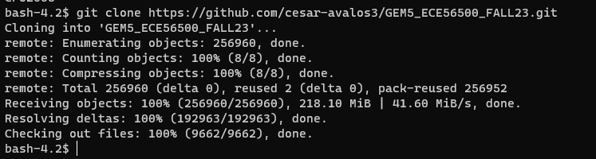

## ECE 565 Programming Assignment 1 Fall 2022
### Professor Mithuna Thottethodi

1. **Introduction**
    
    This assignment will serve as an introduction to the `gem5` simulator. It will walk you through the necessary steps to set up the simulator on your account, and provide you with some introductory tasks that will help you familiarize yourself with the `gem5` structure and source tree. While the tasks aren’t difficult in and of themselves, do not underestimate the time it will take to get familiar with the `gem5` source tree before you’ll be able to complete the tasks.
 The `gem5` simulator is written primarily in C++. However, configurations are done in Python, so you’ll need to be familiar with Python as well. It’s easy to read, but be aware that spacing in Python matters if you find yourself editing a Python file for the first time – it’s worth finding a quick tutorial on Python to learn the basics. A utility called SWIG is used to combine the configurations in Python and the actual simulator written in C++.
    
1. **Setup**
    The programming assignment will be completed on a cluster of "qstruct" servers. There are 19 of these machines. You can access them by ssh’ing into qstruct.ecn.purdue.edu from any terminal. You will use your Purdue Career Account username and password. Below is the sample command for logging in:
        
    ```console
    ssh <your-career-user-id>@qstruct.ecn.purdue.edu
    ```
    
    You will clone a repository that contains a customized version of the gem5 simulator into your own accounts and do all your programming in your local copies.
 
    ```console
    git clone /home/yara/mithuna2/gem5-Fall2022
    ``` 

    Do **not** clone the repository directly from gem5.org. The ECE-565 customized version has changes for compatibility with ECN-installed libraries. 
   
    (Git is the world's most popular revision control system, so if you are not familiar with it, now is a great time :).
    Given it's popularity, it is easy to find high quality documentation/tutorials online. This assignment document will provide you with the basic commands, but it is a good idea to become broadly familiar with git.)
    
    You now have your own fresh copy of gem5! Going into your gem5 directory, you’ll see a variety of folders, including the src directory, where most of your changes will be made. You may find yourself working in the configs directory from time to time as well. It is worth spending some time exploring these directories to get a feel for where different things are.
    
    
    
1. **Building gem5**
    
    The default gcc binaries and libraries available on ECN machines are not compatible with the version of gem5 we use. To use the non-standard version of gcc, some environment variables must be changed. 
    
    Modify your `PATH` environment variable to include: `/package/gcc/8.3.0/bin`
    Modify your `LD_LIBRARY_PATH` environment variable to include: `/package/gcc/8.3.0/lib64`
    
    (Note that the directories should be added to the beginning of the environment variables to ensure that the correct version of `gcc` is picked up by `scons-3` . The exact command to add these directories to the environment variable depends on the shell you use. It is your responsibility to figure out the appropriate steps.)

    gem5 is a highly configurable architectural simulator that supports a number of ISAs (x86, ARM, MIPS, SPARC, POWER, RISCV), CPU Models (InOrder, O3, AtomicSimple, TimingSimple, Minor (in-order)), and two Memory Models (Classic, Ruby). To understand how to build gem5, you must understand what you are building first. Example `gem5` build files are located in `gem5/build_opts`. For this assignment you will use the ECE565-specific build options from the ’ECE565-X86’ file whose content is as follows:
    
    ```console
    TARGET_ISA = ’x86’
    CPU_MODELS = ’AtomicSimpleCPU,TimingSimpleCPU,O3CPU,MinorCPU’
    PROTOCOL = ’MI_example’
    ```
    
    
    
    In this assignment, the MinorCPU is the relevant CPU model.
    
    We will be using the latest version of gem5, which has fairly up-to-date documentation outside of this assignment.
    For additional pointers on gem5, please see the book on learning gem5:
    
    https://www.gem5.org/documentation/learning_gem5/introduction/
    
    This file indicates that the target ISA is X86, and all of the CPU Models should be compiled in. The last line PROTOCOL is a specific type of coherence protocol for the Ruby Memory Model, which we will ignore for now.
For this assignment, we will use the ECE565-C86 and the ECE565-ARM build configurations. Now, the command to build this configuration is:
    
    ```console
    scons-3 USE_HDF5=0 -j `nproc` ./build/ECE565-X86/gem5.opt
    ```
    
    You may be missing the gem5 style hook. If so, just hit enter and let the script install the style hook for you. This build will take quite a while the first time around, so using multiple processes (using the ``-j `nproc` `` option) is valuable. The `nproc` argument results in the use of as many processes as number of processors in the system (40 on qstruct). Even so, it can take over 10 minutes to build. When you build the simulator with scons, all of your source code is copied into the gem5/build directory for that particular build. This means two things. First, you can always simply remove the build directory (or a specific build’s directory inside gem5/build) to start from scratch (think of it like a "make clean"). Second, never make any manual changes within the build directory. You should make your changes elsewhere (i.e. gem5/src), and re-build the simulator. Re-building gem5 after the first build typically only takes a minute or two, depending on your changes.

1. **Running gem5: Hello World**
    
    The gem5.opt file you built with scons is your binary – this is what you will use to run the simulator. It takes in options and a simulation script (this is where Python comes in). To get started, let’s run a Hello World program on the simulator. Looking in your gem5/configs directory, you’ll see directories including `example`. Take a look in the example directory. The se.py script will be what we need to run Hello World. Take a look at it. You won’t understand all of it just now, but you’ll see how it’s setting up different gem5 configurations.
    
    Now that we have a script to use with gem5, we need an actual Hello World binary to run on the simulator. gem5 comes with Hello World binaries already compiled for each ISA it supports. You can find them in gem5/tests/test-progs/hello/bin. Since we’ve built an x86 model, we’ll want the gem5/tests/test-progs/hello/bin/x86/linux/hello binary. 
    
    To actually run Hello World, go back to your gem5/ directory. The gem5 binary, the configuration script, and the hello binary are all used with the following command:
    
    ```console
    ./build/ECE565-X86/gem5.opt configs/example/se.py -c tests/test-progs/hello/bin/x86/linux/hello
    ```
   
    Notice that now there is a gem5/m5out directory. Inside, you’ll see a couple of configuration and stats files – they’re specific to your Hello World run. These will be very useful for tracking data in the future.
    
1. **Running gem5: Benchmarks**
    
    For the programming assignment, you’ll need to run benchmarks from the SPEC CPU benchmark suite. Runscripts for running select SPEC2006 CPU benchmarks are provided for you in `<gem5-root>/configs/spec/`. (If you don't see this directory, please pull from the git repo.) Specifically, the following six benchmarks have been tested on ECN machines: `sjeng`, `leslie3d`, `lbm`, `astar`, `milc`, and `namd`. The same runscript can be used to select and run any benchmark of your choice as follows:
    
    ```console
    ./build/ECE565-X86/gem5.opt configs/spec/spec_se.py -b <benchmark-name> --maxinsts=1000000
    ```

    where `<benchmark-name>` must be replaced with any one of the six benchmark names listed above. You should use all six benchmarks for this homework. 
    In the spec_se.py script, we import the Options module from configs/common/Options.py. This allows us to pass arguments that control various simulation parameters, ranging from the maximum number of instructions to be simulated, the CPU model, and cache type, to the DRAM size, and so on. For this assignment, we have set the --maxinsts limit to 1M instructions. It is worth noting that in contemporary publications, the standard typically hovers around 1B instructions.
   
